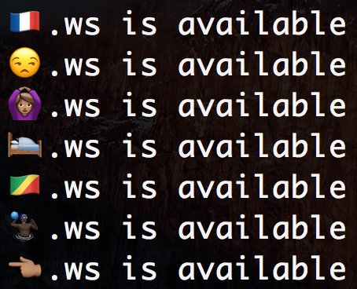

<p align="center">
  
</p>

## ⚡️ Getting Started
```
$ git clone https://github.com/matiastucci/emoji-domain
$ cd emoji-domain
$ npm i
$ npm start
```

## 🕵️ Registering domains
* (Paid) `.ws`: [❤️❤️❤️.ws](http://❤️❤️❤️.ws)
* (Free) `.tk | .ml | .ga | .cf | .gq`: http://www.freenom.com (you'll need to [convert it to Punycode](https://www.punycoder.com))

## 👌 Examples
* [🇦🇷.tk](http://🇦🇷.tk)
* [🖖🏼.tk](http://🖖🏼.tk)
* [💻.ml](http://💻.ml)
* [🖕.ml](http://🖕.ml)
